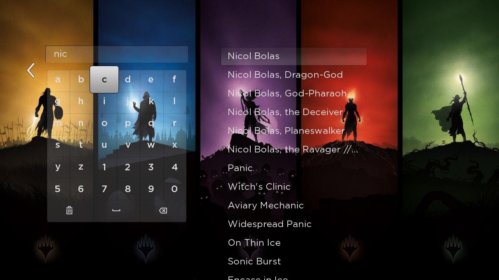
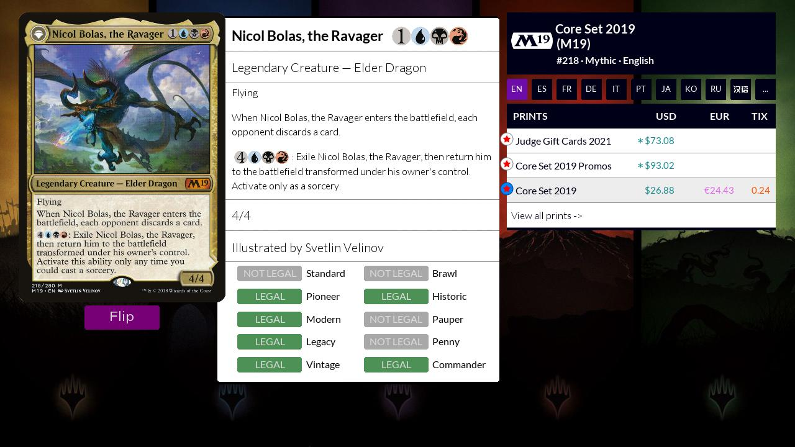
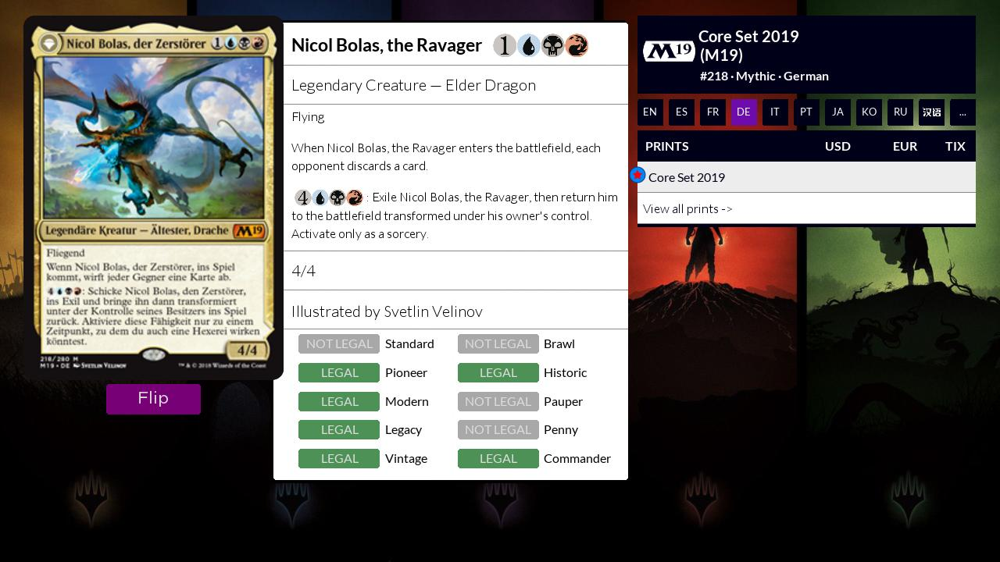
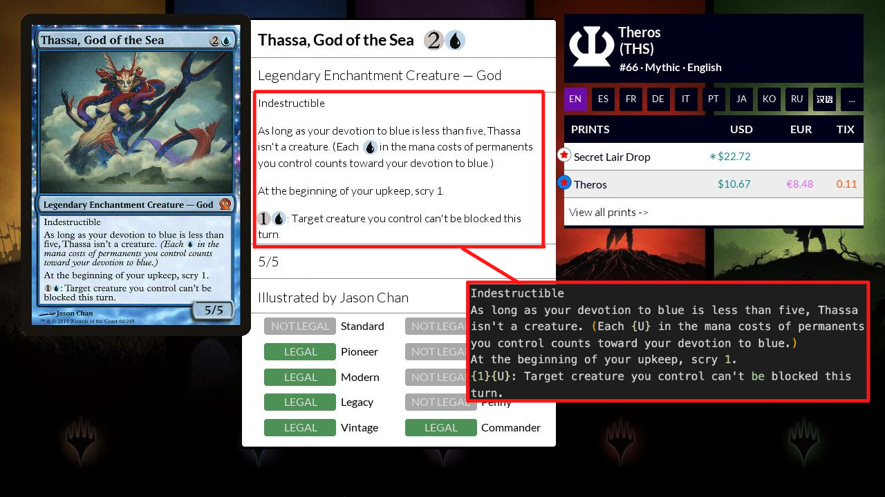
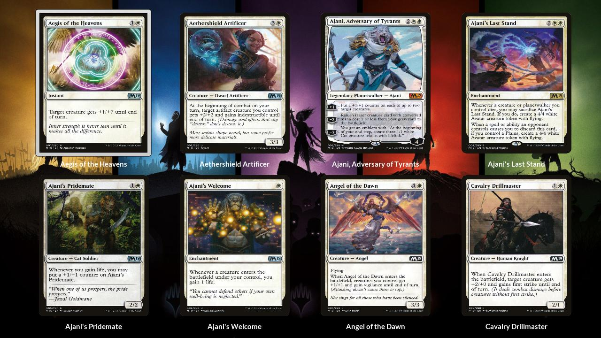

## MTG: The Searchening (Roku Edition)

#### This is built to run in VS Code with the [BrightScript Language][1] extension
[1]: https://marketplace.visualstudio.com/items?itemName=RokuCommunity.brightscript/ "BrightScript Extension"

### What it is:

- This is a side project that I used to get more comfortable with Brightscript.  It is designed to clone the core functionality around Scryfall.com - the searching of cards and sets.  This uses the [Scryfall API](https://scryfall.com/docs/api "Scryfall API") and I have tried to match Scryfall as closely as possible.

- It is an on-going project that I tinker with from time to time when the desire hits.

### What it is not:

- This is not something to be monetized.
- This is not anything designed to compete with Scryfall for any reason.

### Screenshot Demo
#### This is the landing screen where you can search for a specific card or entire set
 
    
  

#### This is the main card viewing screen
 
    
  

#### Showing the card in a different language
 
    
  

#### The hardest thing to accomplish was a replacement effect like JavaScript would use for inserting icons.  You can see in this image that the displayed text with images woven in (the white box) actually comes in as pure text (the black box).  So I had to write an algorithm that would calculate the text symbol's placement and replace it with the appropriate mana symbol image.
 
    
  

#### This is how an entire set of cards looks loaded up
 
    
  

#### Known Issues to resolve:

- When searching for basic lands the program can crash. This is due to the pulling in of all languages that the basic lands were printed in.
- There are a lot of set symbols.  Some of them do not show up.  I correct them as I come across them.  Roku does not support svg's so I have to create each set symbol to be used then hook it up in the program.
- There is currently a problem where if you search for a card, then use the set at the top of the page to search for the set, and select a different card, the same card originally searched for will show up
- The navigation going between individual cards and sets, using the back button, can be wonky and throw an error
- These can be tracked [here](https://github.com/BrianWillett/Roku-The-Searchening/issues "Bugs")

###### Written at [REDspace](https://www.redspace.com "REDspace") by [Brian Willett](https://github.com/BrianWillett "Me")